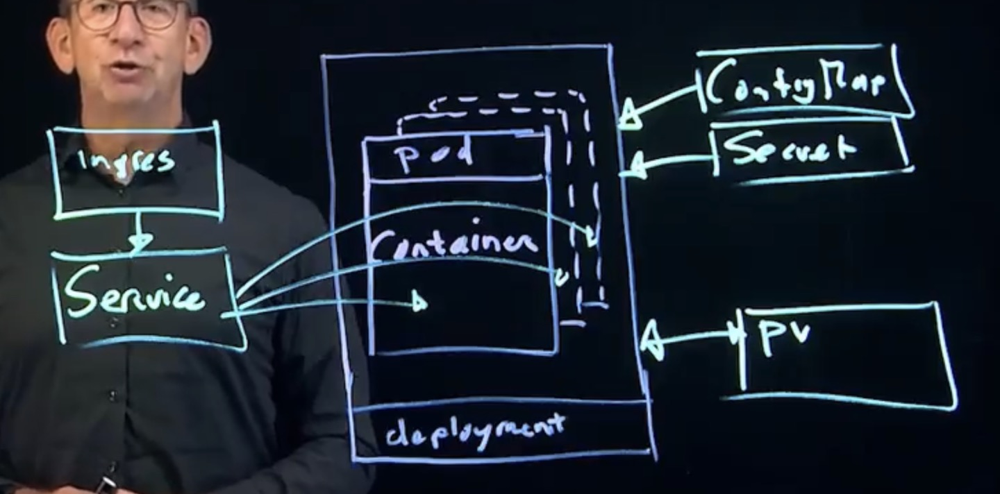

# Cloud Native Computing & Kubernetes Ecosystem

## What is Cloud Native Computing?

- To provide access to applications on the Internet, the application should be hosted in cloud.
- While being hosted in cloud, the application is decoupled from specific servers.
- If an application is disconnected from any specific server, facilities must be provided to take care of specific features:
  - Access to configuration
  - Persistent storage
  - Application access
- Cloud native computing is taking care of all of these.

## Kubernetes and Cloud Native

- Kubernetes is the open-source platform that allows containers to be used in a cloud native environment.
- To do so, it orchestrates containers, which means that it ensures that containers are running where they need to be running.
- Kubernetes also provides scalability: ensuring a sufficient amount of containers are running to deal with the current workload.
- The Kubernetes API defines a set of resource types, such as Pods, Deployment, and ConfigMaps that allow for storing information in a cloud native environment where no relation to specific servers exists.

## Kubernetes Origins

- Google Borg is at the origins of Kubernetes.
- It is a platform that Google had been using since the early 2000's to offer Google applications in a cloud-based environment.
- Based on Google Borg, Google open-sourced a platform-agnostic solution for orchestrating containers.
- Kubernetes was first announced in June of 2014, and the source code was donated to Cloud Native Computing Foundation in 2015.


## Ecosystem and Distributions

- CNCF provides an open environment where different projects can provide solutions for cloud native computing.
- As a result it has different projects that propose a solution for the same problem.
- While running Kubernetes, users need to choose which projects to use on top of Kubernetes to provide which type of functionality.
- This can be done by selecting individual projects and integrating them with Vanilla Kubernetes.
- As an alternative, a Kubernetes distribution can be used.


## Kubernetes Distributions

- In a Kubernetes distribution, CNCF projects are integrated in a working Kubernetes environment.
- Some distributions are "opinionated", which means that just one CNCF project is integrated to provide a specific solution.
- Some distributions are more open, and leave a choice to its users about the specific solution that they're going to use.
- The distribution may also provide support, which makes it possible to run Kubernetes in environments where reliability is important.

## Distribution Types

### Cloud Managed Distributions
- Integrate in a public cloud offering, and include:
  - EKS (Amazon)
  - AKS (Azure)
  - GKE (Google)

### On-premises Distributions
- Focus on installation in a company's datacenter or private cloud:
  - Google Anthos
  - Rancher
  - Red Hat OpenShift
  - Canonical Kubernetes


## Kubernetes Architecture

### Control Plane
The control plane consists of one or more nodes where the Kubernetes core services are running.

#### Core Components:
- **kube-apiserver**: Provides access to the API
- **etcd**: The Kubernetes database
- **kube-scheduler**: Responsible for scheduling Pods at a specific location
- **kube-controller-manager**: Manages core Kubernetes processes

### Worker Nodes
The worker nodes run the containerized applications by using two core services.

#### Core Services:
- **container runtime**: The part that actually runs containers
- **kubelet**: The part that is contacted by the kube-scheduler to run the actual containers in Pods




## Kubernetes API Resources List

```shell
kubectl api-resources | less
```

## API Resources

- Kubernetes API resources allow for storing and running applications in a Kubernetes environment.
- Essential resources include:

The `kubectl api-resources` command shows available API resources including:
- `ingresses` (ing) - networking.k8s.io/v1
- `networkpolicies` (netpol) - networking.k8s.io/v1
- `runtimeclasses` - node.k8s.io/v1
- `poddisruptionbudgets` (pdb) - policy/v1
- `clusterrolebindings` - rbac.authorization.k8s.io/v1
- `rolebindings` - rbac.authorization.k8s.io/v1
- `priorityclasses` (pc) - scheduling.k8s.io/v1
- `csidrivers` - storage.k8s.io/v1
- `storageclasses` (sc) - storage.k8s.io/v1
- And many more resource types for managing Kubernetes clusters


### Resource Types Description

- **Pod**: the minimal entity managed by Kubernetes. Runs containers
- **Deployment**: adds replication and zero-downtime updates to Pods
- **ConfigMap**: used to store configuration files and startup parameters
- **Services**: load balances incoming traffic to application instances
- **Ingress/Gateway API**: provides a reversed proxy for application access
- **Persistent Volumes**: represent persistent non-ephemeral storage

### Documents

```shell
kubectl explain pod
```

https://kubernetes.io/docs/concepts/workloads/pods