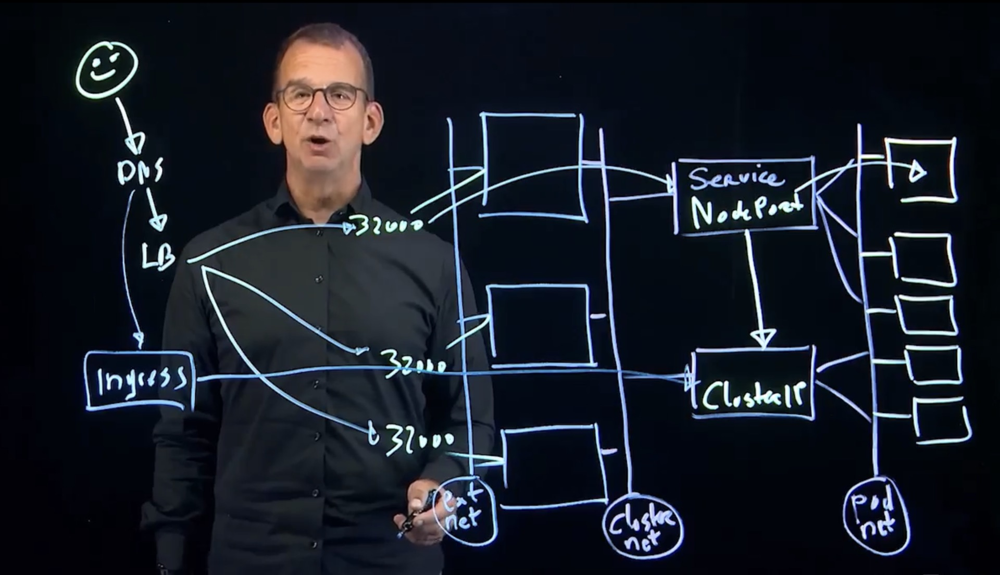
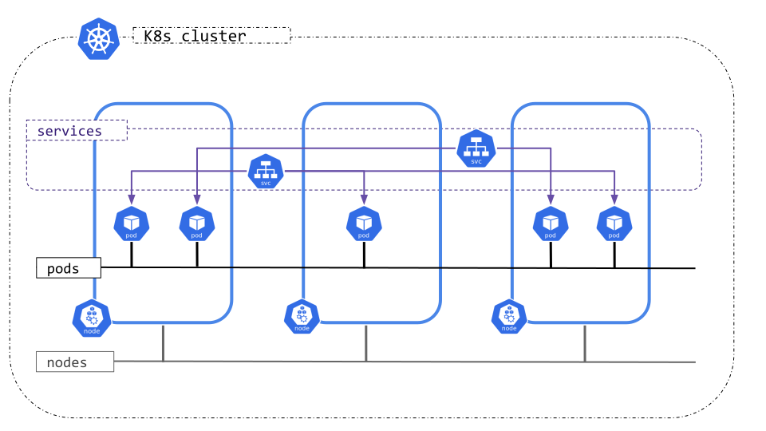

# Lesson 10: Networking

> Service is a concept of nothing but networking.

## Content

- 10.1 Kubernetes Networking

- 10.2 Services

- 10.3 Creating Services

- 10.4 Service Resources in Microservices

- 10.5 Services and DNS

- 10.6 NetworkPolicy

- 10.7 Advanced Networking: Gateway API and Istio

  -  Lesson 10 Lab: Managing Services

  - Lesson 10 Lab Solution: Managing Services

## Kubernetes Networking

End to end networking 

Kubernetes IP address ranges

Kubernetes clusters require to allocate non-overlapping IP addresses for Pods, Services and Nodes, from a range of available addresses configured in the following components:

- The network plugin is configured to assign IP addresses to Pods.
- The kube-apiserver is configured to assign IP addresses to Services.
- The kubelet or the cloud-controller-manager is configured to assign IP addresses to Nodes.

## Services

- A Service is an API resource that is used to expose a set of Pods.
- Services are applying round-robin load balancing to forward traffic to specific Pods.
- The set of Pods that is targeted by a Service is determined by a selector (which is a label).
- The kube-controller-manager will continuously scan for Pods that match the selector and include these in the Service.
- If Pods are added or removed, they immediately show up in the Service.

---

## Services and Decoupling

- Services exist independently from the applications they provide access to.
- The Service needs to be created independently of the application, and after removing an application, it also needs to be removed separately.
- The only thing they do is watch for Pods that have a specific label set matching the selector that is specified in the service.
- That means that one Service can provide access to Pods in multiple Deployments, and while doing so, Kubernetes will automatically load balance between these Pods.
- This strategy is used in canary Deployments (covered later).

---

## Service Types

- ClusterIP: this default type exposes the service on an internal cluster IP address.
- NodePort: allocates a specific port on the node that forwards to the service IP address on the cluster network.
- LoadBalancer: provisions an external load balancer to handle incoming traffic to applications in public cloud.
- ExternalName: works on DNS names; redirection is happening at a DNS level, which is useful in migration.
- Headless: a Service used in cases where direct communication with Pods is required, which is used in StatefulSet.

---

## Creating Services

- `kubectl expose` can be used to create Services, providing access to Deployments, ReplicaSets, Pods or other Services.
- In most cases `kubectl expose` exposes a Deployment, which allocates its Pods as the Service endpoint.
- `kubectl create service` can be used as an alternative solution to create Services.
- While creating a Service, the `--port` argument must be specified to indicate the port on which the Service will be listening for incoming traffic.

---

## Service Ports

- While working with Services, different ports are specified:
  - targetPort: the port on the application (container) that the Service addresses.
  - port: the port on which the Service is accessible.
  - nodePort: the port that is exposed externally while using the NodePort Service type.

---

## Demo: Creating Services

- `kubectl create deployment nginxsvc --image=nginx`
- `kubectl scale deployment nginxsvc --replicas=3`
- `kubectl expose deployment nginxsvc --port=80`
- `kubectl describe svc nginxsvc` # look for endpoints
- `kubectl get svc nginxsvc -o=yaml`
- `kubectl get svc`
- `kubectl get endpoints`
- `minikube ssh`
- `curl http://svc-ip-address`
- `exit`
- `kubectl edit svc nginxsvc`
  - Set `protocol: TCP`
  - Set `nodePort: 32000`
  - Set `type: NodePort`
- `kubectl get svc`
- (from host): `curl http://$(minikube ip):32000`

# Understanding Microservices

- In a microservices architecture, different frontend and backend Pods are used to provide the application.
- Backend Pods (like databases) should be exposed internally only, using the ClusterIP Service type.
- Frontend Pods (like webservers) should be exposed for external access, using the NodePort Service type or the Ingress resource.
- For more advanced traffic management in microservices, a service mesh can be used.

---

# Services and DNS

- Exposed Services automatically register with the Kubernetes internal coredns DNS server.
- The standard DNS name is composed as servicename.namespace.svc.clustername
- As a result, Pods within the same Namespace can access servicename by using its short name.
- To access servicenames in other Namespaces, the fully qualified domain name must be used.

---

# Demo: Services and DNS

- kubectl describe svc -n kube-system kube-dns
- kubectl create ns elsewhere
- kubectl run nginxpod --image=nginx -n elsewhere
- kubectl expose -n elsewhere pod nginxpod --port=80
- kubectl run testpod --image=busybox --sleep infinity
- kubectl exec -it testpod -- cat /etc/resolv.conf
- kubectl exec -it testpod -- wget --spider --timeout=1 nginxpod # fails
- kubectl exec -it testpod -- wget --spider --timeout=1 nginxpod.elsewhere.svc.cluster.local

---

# NetworkPolicy

By default, there are no restrictions to network traffic in K8s.

Pods can always communicate, even if they're in other Namespaces.

To limit this, NetworkPolicies can be used.

NetworkPolicies need to be supported by the network plugin though,

The Weave plugin does NOT support network policies!

Calico is a common plugin that does support NetworkPolicy.

If in a policy there is no match, traffic will be denied.

If no NetworkPolicy is used, all traffic is allowed.

---

# NetworkPolicy Identifiers

- In NetworkPolicy, three different identifiers can be used:

  - podSelector: specifies a label to match Pods.
  - namespaceSelector: used to grant access to specific namespaces.
  - ipBlock: marks a range of IP addresses that is allowed. notice that traffic to and from the node where a Pod is running is always allowed.

- When defining a Pod- or Namespace-based NetworkPolicy, a selector label is used to specify what traffic is allowed to and from the Pods that match the selector.

- NetworkPolicies do not conflict, they are additive.

---

# Demo: Using NetworkPolicy

- kubectl get pods -n kube-system | grep -i calico
- kubectl apply -f nwpolicy-complete-example.yaml
- kubectl expose pod nginx --port=80
- kubectl exec -it busybox -- wget --spider --timeout=1 nginx will fail
- kubectl label pod busybox access=true
- kubectl exec -it busybox -- wget --spider --timeout=1 nginx will work

---

# Terminal Output

student@ckad:~/ckad$ kubectl describe networkpolicy
access-nginx mysql-1718207222 nginx-1718207653
student@ckad:~/ckad$ kubectl describe networkpolicy access-nginx
Name: access-nginx
Namespace: default
Created on: 2024-06-12 16:49:40 +0000 UTC
Labels: <none>
Annotations: <none>
Spec:
PodSelector: app=nginx
Allowing ingress traffic:
To Port: <any> (traffic allowed to all ports)
From:
PodSelector: access=true
Not affecting egress traffic
Policy Types: Ingress
student@ckad:~/ckad$ kubectl label pod busybox access=true
pod/busybox labeled
student@ckad:~/ckad$ kubectl exec -it busybox -- wget --spider --timeout=1 nginx
Connecting to nginx (10.110.198.214:80)
remote file exists
student@ckad:~/ckad$

---

# What is Gateway API

- Gateway API provides routing and traffic management policies.
- It is an advanced layer that uses custom resources for managing incoming (ingress) and outgoing (egress) traffic.
- Gateway API adds features that are not addressed by Ingress, including:
  - Support for TCP, UDP and gRPC
  - Traffic splitting and mirroring
  - Websocket protocols
- Future developments seem to further integrate Gateway API functionality with Ingress.
- You'll learn more about Gateway API in the next lesson.

---

# What is Istio

- Istio is a service mesh and makes managing complex relations between applications in a microservice easier.
- As such, it provides rules for managing traffic in microservices.
- It includes features for traffic management, security, and observability in the service mesh.
- Its focus is on service-to-service communication.
- Istio may be used in addition to core Kubernetes networking and is optional.

# References 
- https://kubernetes.io/docs/concepts/cluster-administration/networking/
- https://www.tigera.io/learn/guides/kubernetes-networking/
- https://www.youtube.com/watch?v=J8jAzqbXxjE
- https://spacelift.io/blog/kubernetes-networking
